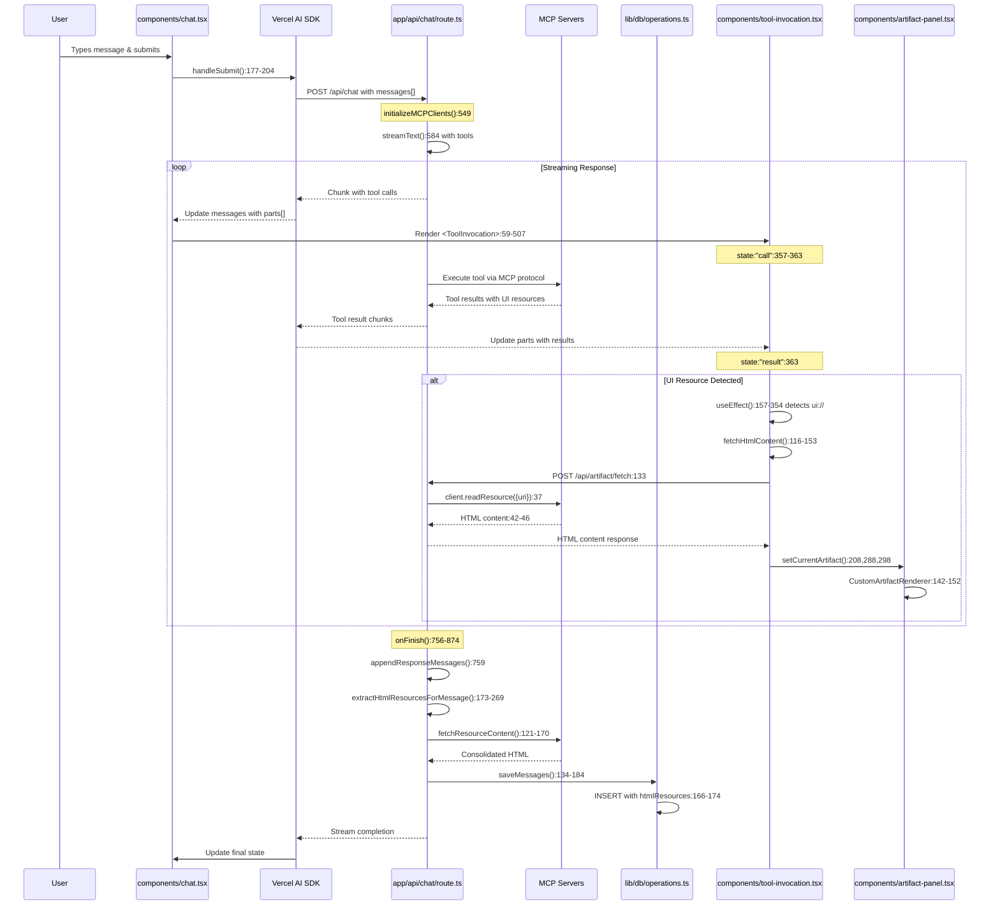
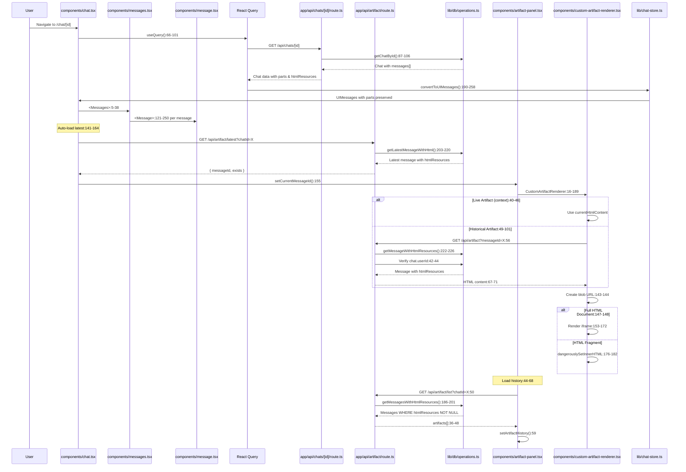

# MCP Resource/Artifact System Documentation

## 1. Tool Call Processing & Rendering

**Data Stream Flow:**
- Messages arrive via Vercel AI SDK's `useChat` hook (components/chat.tsx:177-204) with structured `parts` array
- Each part has a type: `text`, `tool-invocation`, or `reasoning`
- Tool invocations contain: `toolName`, `state` (call/result), `args`, and `result`

**UI Rendering:**
- **components/message.tsx:162-198**: Parts are mapped and rendered based on type
- Tool invocations rendered via `<ToolInvocation>` component 
- Component tracks state: "call" (waiting/running) vs "result" (completed)
- Live message detection: `isLatestMessage && status !== "ready" && message.role === "assistant"`

## 2. Artifact Display Following Resource Fetch

**Resource Detection:**
- **components/tool-invocation.tsx:156-354**: `useEffect` monitors tool results for UI resources
- Checks for resources with `uri` starting with "ui://"
- Detection patterns:
  - Direct resource objects: `result.type === 'resource' && result.uri`
  - Nested content arrays: `result.content[].resource.uri`
  - Stringified JSON: Parses `result` string or `content[].text` for embedded resources
- Special case: "ui://graph-visualization" routes to artifact panel via `setCurrentArtifact()`

**HTML Content Fetching:**
- **components/tool-invocation.tsx:116-153**: `fetchHtmlContent()` retrieves resource data
- Makes POST to `/api/artifact/fetch` with URI and MCP servers
- **app/api/artifact/fetch/route.ts**: Connects to streamable-http MCP servers
- Uses MCP protocol's `client.readResource({ uri })` 
- Returns text content or decoded base64 blob

**Artifact Panel Display:**
- **components/artifact-panel.tsx**: Side panel controlled by `isArtifactVisible`
- **components/custom-artifact-renderer.tsx**: 
  - Checks context for live artifacts: `currentMessageId === messageId && currentHtmlContent`
  - Otherwise fetches from `/api/artifact?messageId=X` for historical artifacts
  - Renders via iframe for full HTML documents (detected by doctype/html tags)
  - Uses `dangerouslySetInnerHTML` for HTML fragments

## 3. Chat & Artifact Storage from Streaming

**Stream Processing:**
- **app/api/chat/route.ts:756-874**: `onFinish` callback after stream completes
- Calls `appendResponseMessages()` to merge streamed messages with existing
- Deduplicates using content-based keys: `${role}:${content.substring(0, 100)}`

**Per-Message HTML Extraction:**
- **app/api/chat/route.ts:173-269**: `extractHtmlResourcesForMessage()` 
- Scans `tool-invocation` parts for UI resources via `hasUIResourcesInResult()`
- Collects unique resource URIs from:
  - Direct resource results
  - Content arrays with resources  
  - Stringified JSON containing resources
- Fetches HTML via `fetchResourceContent()` from MCP servers

**Database Storage:**
- **app/api/chat/route.ts:271-352**: `convertToDBMessagesWithHTMLExtraction()`
- Creates DB message with `htmlResources` field if UI resources detected
- **lib/db/operations.ts:134-184**: `saveMessages()` inserts to PostgreSQL
- Schema (lib/db/schema.ts): `messages.htmlResources` text column stores HTML

## 4. Loading Past Chats & Artifacts

**Chat Loading:**
- **components/chat.tsx:66-101**: React Query fetches via `useQuery()`
- GET `/api/chats/[id]` returns chat with messages
- **components/chat.tsx:112-138**: `convertToUIMessages()` transforms DB format
- Preserves `parts` array with tool invocations and results

**Artifact Loading:**
- **components/custom-artifact-renderer.tsx:28-101**:
  - Priority 1: Check artifact context for current live artifact
  - Priority 2: Fetch from database via `/api/artifact?messageId=X`
- **app/api/artifact/route.ts GET**: 
  - Calls `getMessageWithHtmlResources(messageId)`
  - Verifies user owns chat via `chats.userId` check
  - Returns stored `htmlResources` content

**Auto-load Latest Artifact:**
- **components/chat.tsx:141-164**: On chat load, fetches `/api/artifact/latest?chatId=X`
- Sets `currentMessageId` in artifact context to display most recent

## 5. Artifact History System

**History Loading:**
- **components/artifact-panel.tsx:44-68**: `useEffect` loads history when chat/messageId changes
- GET `/api/artifact/list?chatId=X` returns all artifacts

**History API:**
- **app/api/artifact/list/route.ts**:
  - Calls `getMessagesWithHtmlResources(chatId, userId)`
  - **lib/db/operations.ts:186-201**: Queries messages WHERE `htmlResources IS NOT NULL`
  - Returns array with `messageId`, `createdAt`, and extracted description

**History UI:**
- Dropdown menu with artifact list
- Click to switch via `setCurrentMessageId()`

## Workflow Diagrams

### Complete Message-to-Artifact Workflow

### Database Loading & Artifact Retrieval

## Critical Implementation Details

- HTML resources stored per-message, not globally - enables precise artifact tracking
- Resource URIs deduplicated during extraction to avoid redundant fetches
- Content-based message deduplication prevents duplicate DB entries
- MCP servers converted to streamable-http format for consistent access
- Artifact panel tied to specific messageId for accurate display
- Supports multiple resources per message (concatenated with separators)
- User authorization validated at every artifact access point

